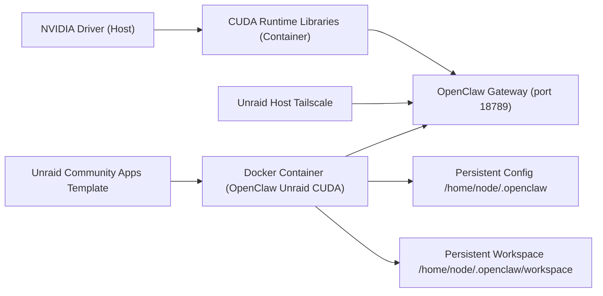

# OpenClaw Unraid CUDA Architecture

## Problem Statement
The existing Unraid deployment model for OpenClaw relies on mutable startup behavior (`npm link`, package installs, and in-container Tailscale bootstrapping), root execution, and elevated capabilities. This causes:

- Permission drift between container and host appdata directories.
- Non-reproducible runtime state across redeployments.
- Expanded attack surface (`NET_ADMIN`, root, runtime downloads).
- Operational coupling between application runtime and networking control plane.

## Goals and Success Criteria

### Goals
- Deliver a production-ready Unraid image with CUDA runtime libraries pinned in-image.
- Provide a profile split with a hardened default (`core`) and an optional full-featured image (`power`) for advanced skill workflows.
- Use Unraid host Tailscale integration only (no in-container VPN daemon).
- Provide a CA-ready template with secure defaults and optional advanced mounts.
- Support clean operational lifecycle: install, restart, recreate, and upgrade.

### Success Criteria
- Container starts without runtime package installers.
- Default runtime is non-root and runs with bridge networking.
- Core image remains backward-compatible with existing template/tag expectations.
- Power image adds optional Homebrew + Playwright/Chromium support without changing config/workspace paths.
- OpenClaw state persists across redeployments using documented mounts.
- GPU-enabled hosts expose CUDA runtime successfully with `--gpus all`.
- Template contains no hardcoded API keys or secrets.

## Non-Goals
- AMD ROCm or Intel GPU acceleration in v1.
- In-container Tailscale daemon lifecycle.
- Host-network default template behavior.
- Stable releases built from floating upstream branches.

## Runtime Architecture

## Security Model
- Container defaults to non-root user (`node`).
- Template removes `NET_ADMIN`, privileged mode, and in-container network daemons.
- No runtime `curl | sh` style installers.
- Gateway token is required and never shipped with defaults.
- Bridge networking with explicit port mapping is the default boundary.
- Optional root execution is only for one-time ownership repair and is not default.
- Heavier skill tooling (Homebrew, Playwright browsers) is isolated to the optional `power` profile.

## Runtime Profiles
- `core` (default): CUDA runtime, OpenClaw, QMD, Bun, ffmpeg, and common CLI tooling.
- `power` (optional): `core` plus Linuxbrew/Homebrew and preinstalled Playwright/Chromium support.
- Both profiles use the same config/workspace paths and entrypoint contract.

## Compatibility Matrix Baseline
| Component | Baseline |
|---|---|
| Unraid | 6.12+ |
| GPU support | NVIDIA only |
| CUDA runtime | 13.1 (`nvidia/cuda:13.1.1-runtime-ubuntu22.04`) |
| OpenClaw source | Pinned upstream git tags (currently `v2026.2.23`) |
| Image profiles | `core` (default), `power` (optional) |
| Network mode | Bridge + explicit port mapping |
| Tailscale | Host-integrated only |

## Risk Register
| Risk | Detection Signal | Owner | Mitigation |
|---|---|---|---|
| Upstream OpenClaw build changes break Docker build | CI build failure on tag update | Maintainer | Pin tags, validate in beta channel, maintain compatibility notes |
| Host NVIDIA driver mismatch | Gateway starts but GPU workloads fail | Operator + Maintainer | Publish minimum driver guidance and troubleshooting matrix |
| Permission mismatch on existing appdata | Startup cannot create/write state dirs | Operator | PUID/PGID guidance + one-time migration script + ownership repair workflow |
| CA template drift from runtime contract | Generated run command includes removed flags | Maintainer | Contract tests over template XML in CI |
| Users expect in-container Tailscale | Access/report confusion in issues | Maintainer | Explicit docs and template overview language stating host-only model |

## Acceptance
This document is decision complete for implementation of the v1 architecture and avoids open design choices for container hardening, networking model, and GPU scope.
